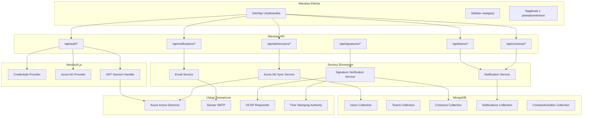
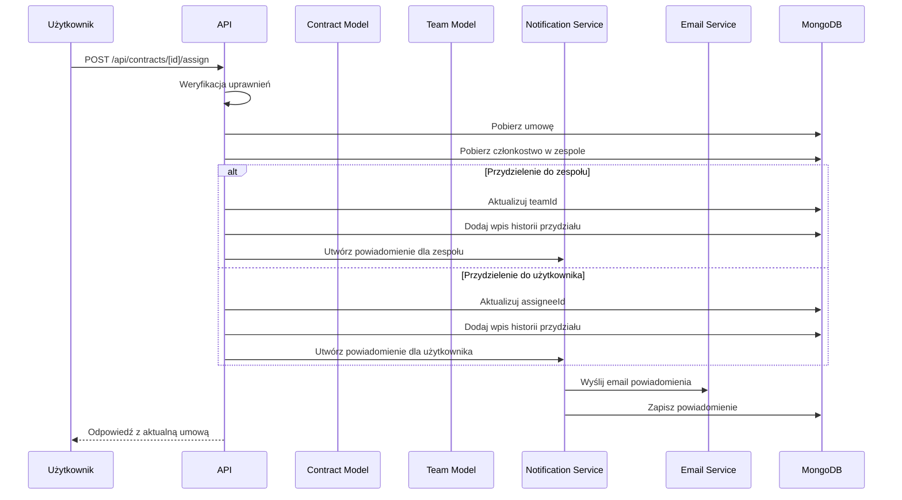

# Plan Implementacji Funkcjonalności Współpracy Grupowej

## Spis Treści

1. [Przegląd Architektury](#przegląd-architektury)
2. [Integracja z Azure Active Directory](#integracja-z-azure-active-directory)
3. [Moduł Zarządzania Użytkownikami](#moduł-zarządzania-użytkownikami)
4. [Moduł Zarządzania Grupami/Zespołami](#moduł-zarządzania-grupamizespołami)
5. [System Powiadomień Email](#system-powiadomień-email)
6. [Moduł Weryfikacji Podpisów Kwalifikowanych](#moduł-weryfikacji-podpisów-kwalifikowanych)
7. [Harmonogram Implementacji](#harmonogram-implementacji)

---

## Przegląd Architektury

### Diagram Architektury Systemu



### Przepływ Przydzielania Umowy



---

## Integracja z Azure Active Directory

### 1.1. Konfiguracja Dostawcy Azure AD

**Lokalizacja:** `src/lib/auth.ts`

```typescript
// Nowa konfiguracja z dostawcą Azure AD
import NextAuth, { NextAuthConfig } from 'next-auth';
import AzureADProvider from 'next-auth/providers/azure-ad';
import Credentials from 'next-auth/providers/credentials';
import { connectToDatabase } from './mongodb';
import User from '@/models/User';

// Konfiguracja środowiskowa wymagana:
// AZURE_AD_CLIENT_ID, AZURE_AD_CLIENT_SECRET, AZURE_AD_TENANT_ID

export const authConfig: NextAuthConfig = {
    providers: [
        AzureADProvider({
            clientId: process.env.AZURE_AD_CLIENT_ID!,
            clientSecret: process.env.AZURE_AD_CLIENT_SECRET!,
            tenantId: process.env.AZURE_AD_TENANT_ID!,
            authorization: {
                params: {
                    scope: 'openid email profile User.Read',
                },
            },
        }),
        Credentials({
            name: 'credentials',
            credentials: {
                email: { label: 'Email', type: 'email' },
                password: { label: 'Password', type: 'password' },
            },
            async authorize(credentials) {
                // Istniejąca logika...
            },
        }),
    ],
    callbacks: {
        async jwt({ token, user, account }) {
            if (account && user) {
                token.accessToken = account.access_token;
                token.id = user.id;
                // Pobierz lub utwórz użytkownika z Azure AD
                await syncAzureUser(user, account);
            }
            return token;
        },
        async session({ session, token }) {
            if (session.user) {
                session.user.id = token.id as string;
                session.user.role = await getUserRole(token.id as string);
            }
            return session;
        },
    },
};
```

### 1.2. Model Użytkownika - Rozszerzenie dla Azure AD

**Lokalizacja:** `src/models/User.ts`

```typescript
// Rozszerzony interfejs IUser
export interface IUser extends Document {
    _id: mongoose.Types.ObjectId;
    email: string;
    name: string;
    password?: string;
    role: UserRole;
    adUsername?: string;
    azureAdId?: string;           // NOWE: ID użytkownika w Azure AD
    azureAdToken?: string;        // NOWE: token dostępu
    azureAdRefreshToken?: string; // NOWE: token odświeżania
    isActive: boolean;
    lastAzureSync?: Date;         // NOWE: data ostatniej synchronizacji
    createdAt: Date;
    updatedAt: Date;
}

// NOWE pola w schemacie
azureAdId: {
    type: String,
    sparse: true,
    index: true,
},
azureAdToken: {
    type: String,
    select: false,
},
azureAdRefreshToken: {
    type: String,
    select: false,
},
lastAzureSync: {
    type: Date,
},
```

### 1.3. Serwis Synchronizacji Azure AD

**Lokalizacja:** `src/lib/azure-sync.ts`

Strategia synchronizacji:

- **Automatyczna** - przy każdym logowaniu użytkownika przez Azure AD
- **Ręczna** - administrator wyzwala synchronizację grup w panelu admina

```typescript
import User from '@/models/User';
import { connectToDatabase } from './mongodb';

interface AzureUserProfile {
    id: string;
    mail: string;
    displayName: string;
    userPrincipalName: string;
    jobTitle?: string;
    department?: string;
    memberOf?: string[]; // Grupy, do których należy użytkownik
}

export class AzureSyncService {
    /**
     * Pobiera szczegółowy profil użytkownika z Microsoft Graph API
     * oraz listę grup, do których należy
     */
    static async getUserProfile(accessToken: string): Promise<AzureUserProfile> {
        // Pobierz podstawowy profil
        const profileResponse = await fetch('https://graph.microsoft.com/v1.0/me', {
            headers: { Authorization: `Bearer ${accessToken}` },
        });
        const profile = await profileResponse.json();

        // Pobierz grupy użytkownika
        const groupsResponse = await fetch(
            'https://graph.microsoft.com/v1.0/me/memberOf?$select=id,displayName',
            { headers: { Authorization: `Bearer ${accessToken}` } }
        );
        const groupsData = await groupsResponse.json();

        return {
            id: profile.id,
            mail: profile.mail || profile.userPrincipalName,
            displayName: profile.displayName,
            userPrincipalName: profile.userPrincipalName,
            jobTitle: profile.jobTitle,
            department: profile.department,
            memberOf: groupsData.value?.map((g: any) => g.id) || [],
        };
    }

    /**
     * Synchronizuje użytkownika z Azure AD (automatyczna przy logowaniu)
     */
    static async syncAzureUser(profile: AzureUserProfile): Promise<IUser> {
        await connectToDatabase();

        let user = await User.findOne({ azureAdId: profile.id });

        if (!user) {
            // Sprawdź czy użytkownik istnieje po email
            user = await User.findOne({ email: profile.mail.toLowerCase() });

            if (user) {
                // Połącz istniejące konto z Azure AD
                user.azureAdId = profile.id;
                user.adUsername = profile.userPrincipalName;
                user.lastAzureSync = new Date();
                await user.save();
            } else {
                // Utwórz nowego użytkownika
                user = await User.create({
                    email: profile.mail.toLowerCase(),
                    name: profile.displayName,
                    role: 'read', // Domyślna rola
                    azureAdId: profile.id,
                    adUsername: profile.userPrincipalName,
                    isActive: true,
                    lastAzureSync: new Date(),
                });
            }
        } else {
            // Aktualizuj dane użytkownika
            user.name = profile.displayName;
            user.lastAzureSync = new Date();
            await user.save();
        }

        return user;
    }

    /**
     * Synchronizuje wszystkich użytkowników z grupy Azure AD (ręczna przez admina)
     */
    static async syncGroupMembers(
        accessToken: string,
        groupId: string
    ): Promise<{ synced: number; errors: number }> {
        const response = await fetch(
            `https://graph.microsoft.com/v1.0/groups/${groupId}/members`,
            {
                headers: { Authorization: `Bearer ${accessToken}` },
            }
        );

        const data = await response.json();
        let synced = 0;
        let errors = 0;

        for (const member of data.value || []) {
            try {
                if (member['@odata.type'] === '#microsoft.graph.user') {
                    // Pobierz pełny profil użytkownika
                    const userResponse = await fetch(
                        `https://graph.microsoft.com/v1.0/users/${member.id}`,
                        {
                            headers: { Authorization: `Bearer ${accessToken}` },
                        }
                    );
                    const userProfile = await userResponse.json();

                    await this.syncAzureUser({
                        id: userProfile.id,
                        mail: userProfile.mail || userProfile.userPrincipalName,
                        displayName: userProfile.displayName,
                        userPrincipalName: userProfile.userPrincipalName,
                    });
                    synced++;
                }
            } catch {
                errors++;
            }
        }

        return { synced, errors };
    }

    /**
     * Pobiera listę grup Azure AD dla użytkownika
     */
    static async getUserGroups(accessToken: string): Promise<Array<{id: string; name: string}>> {
        const response = await fetch(
            'https://graph.microsoft.com/v1.0/me/memberOf',
            {
                headers: { Authorization: `Bearer ${accessToken}` },
            }
        );

        const data = await response.json();
        return data.value?.map((g: any) => ({
            id: g.id,
            name: g.displayName,
        })) || [];
    }
}
```

---

## Moduł Zarządzania Użytkownikami

### 2.1. Rozszerzenie API Zarządzania Użytkownikami

**Lokalizacja:** `src/app/api/admin/users/route.ts`

```typescript
// GET /api/admin/users - Pobiera listę użytkowników z filtrowaniem
export async function GET(request: NextRequest) {
    const session = await auth();
    if (!session || session.user.role !== 'admin') {
        return NextResponse.json({ error: 'Unauthorized' }, { status: 401 });
    }

    await connectToDatabase();

    const { searchParams } = new URL(request.url);
    const search = searchParams.get('search');
    const role = searchParams.get('role');
    const isActive = searchParams.get('isActive');
    const page = parseInt(searchParams.get('page') || '1');
    const limit = parseInt(searchParams.get('limit') || '20');

    const query: Record<string, unknown> = {};

    if (search) {
        query.$or = [
            { name: { $regex: search, $options: 'i' } },
            { email: { $regex: search, $options: 'i' } },
        ];
    }

    if (role) {
        query.role = role;
    }

    if (isActive !== null) {
        query.isActive = isActive === 'true';
    }

    const [users, total] = await Promise.all([
        User.find(query)
            .select('-password -azureAdToken -azureAdRefreshToken')
            .sort({ createdAt: -1 })
            .skip((page - 1) * limit)
            .limit(limit),
        User.countDocuments(query),
    ]);

    return NextResponse.json({
        users,
        pagination: { total, page, limit, totalPages: Math.ceil(total / limit) },
    });
}

// PUT /api/admin/users/[id] - Aktualizuje użytkownika
export async function PUT(
    request: NextRequest,
    { params }: { params: Promise<{ id: string }> }
) {
    const session = await auth();
    if (!session || session.user.role !== 'admin') {
        return NextResponse.json({ error: 'Unauthorized' }, { status: 401 });
    }

    await connectToDatabase();

    const { id } = await params;
    const body = await request.json();
    const { name, email, role, isActive } = body;

    const user = await User.findByIdAndUpdate(
        id,
        { name, email, role, isActive },
        { new: true }
    ).select('-password');

    if (!user) {
        return NextResponse.json({ error: 'User not found' }, { status: 404 });
    }

    return NextResponse.json(user);
}

// POST /api/admin/users/sync-azure - Synchronizuje z Azure AD
export async function POST(request: NextRequest) {
    const session = await auth();
    if (!session || session.user.role !== 'admin') {
        return NextResponse.json({ error: 'Unauthorized' }, { status: 401 });
    }

    const body = await request.json();
    const { groupId } = body;

    const result = await AzureSyncService.syncGroupMembers(
        session.accessToken,
        groupId
    );

    return NextResponse.json({
        message: 'Sync completed',
        ...result,
    });
}
```

### 2.2. Nowe API Użytkownika

**Lokalizacja:** `src/app/api/admin/users/[id]/route.ts`

```typescript
import { NextRequest, NextResponse } from 'next/server';
import { auth } from '@/lib/auth';
import { connectToDatabase } from '@/lib/mongodb';
import User from '@/models/User';
import Team from '@/models/Team';
import Contract from '@/models/Contract';

// GET /api/admin/users/[id] - Pobiera szczegóły użytkownika
export async function GET(
    request: NextRequest,
    { params }: { params: Promise<{ id: string }> }
) {
    const session = await auth();
    if (!session || session.user.role !== 'admin') {
        return NextResponse.json({ error: 'Unauthorized' }, { status: 401 });
    }

    await connectToDatabase();
    const { id } = await params;

    const user = await User.findById(id).select('-password -azureAdToken');

    if (!user) {
        return NextResponse.json({ error: 'User not found' }, { status: 404 });
    }

    // Pobierz statystyki użytkownika
    const [assignedContracts, teamMemberships, totalComments] = await Promise.all([
        Contract.countDocuments({ assigneeId: id }),
        Team.countDocuments({ 'members.userId': id }),
        // TODO: Add comment count query
    ]);

    return NextResponse.json({
        user,
        stats: {
            assignedContracts,
            teamMemberships,
        },
    });
}

// DELETE /api/admin/users/[id] - Dezaktywuje użytkownika
export async function DELETE(
    request: NextRequest,
    { params }: { params: Promise<{ id: string }> }
) {
    const session = await auth();
    if (!session || session.user.role !== 'admin') {
        return NextResponse.json({ error: 'Unauthorized' }, { status: 401 });
    }

    await connectToDatabase();
    const { id } = await params;

    // Soft delete - dezaktywacja użytkownika
    await User.findByIdAndUpdate(id, { isActive: false });

    // Przypisz umowy nieaktywnego użytkownika do adminów
    await Contract.updateMany(
        { assigneeId: id },
        { $unset: { assigneeId: 1 } }
    );

    return NextResponse.json({ message: 'User deactivated successfully' });
}
```

---

## Moduł Zarządzania Grupami/Zespołami

### 3.1. Rozszerzenie Modelu Zespołu

**Lokalizacja:** `src/models/Team.ts`

```typescript
export interface ITeam extends Document {
    _id: mongoose.Types.ObjectId;
    name: string;
    description?: string;
    ownerId: mongoose.Types.ObjectId;
    members: ITeamMember[];
    allowedContractTypes: string[];
    isActive: boolean;
    azureAdGroupId?: string;           // NOWE: ID grupy w Azure AD
    autoAssignEnabled: boolean;        // NOWE: automatyczne przydzielanie
    defaultRole: TeamRole;             // NOWE: domyślna rola dla członków
    createdAt: Date;
    updatedAt: Date;
}

// NOWE pola w schemacie
azureAdGroupId: {
    type: String,
    sparse: true,
    index: true,
},
autoAssignEnabled: {
    type: Boolean,
    default: false,
},
defaultRole: {
    type: String,
    enum: ['admin', 'member', 'viewer'],
    default: 'member',
},
```

### 3.2. Rozszerzenie API Zespołów

**Lokalizacja:** `src/app/api/teams/route.ts`

```typescript
// PUT /api/teams/[id] - Aktualizuje zespół
export async function PUT(
    request: NextRequest,
    { params }: { params: Promise<{ id: string }> }
) {
    const session = await auth();
    if (!session) {
        return NextResponse.json({ error: 'Unauthorized' }, { status: 401 });
    }

    await connectToDatabase();
    const { id } = await params;
    const body = await request.json();
    const { name, description, allowedContractTypes, autoAssignEnabled, defaultRole } = body;

    const team = await Team.findById(id);
    if (!team) {
        return NextResponse.json({ error: 'Team not found' }, { status: 404 });
    }

    // Sprawdź uprawnienia
    const member = team.members.find(m => m.userId.toString() === session.user.id);
    if (!member || !['owner', 'admin'].includes(member.role)) {
        return NextResponse.json({ error: 'Forbidden' }, { status: 403 });
    }

    // Aktualizuj zespół
    if (name) team.name = name;
    if (description !== undefined) team.description = description;
    if (allowedContractTypes) team.allowedContractTypes = allowedContractTypes;
    if (autoAssignEnabled !== undefined) team.autoAssignEnabled = autoAssignEnabled;
    if (defaultRole) team.defaultRole = defaultRole;

    await team.save();

    return NextResponse.json(team);
}

// POST /api/teams/[id]/sync-azure - Synchronizuje członków z Azure AD
export async function POST(
    request: NextRequest,
    { params }: { params: Promise<{ id: string }> }
) {
    const session = await auth();
    if (!session) {
        return NextResponse.json({ error: 'Unauthorized' }, { status: 401 });
    }

    await connectToDatabase();
    const { id } = await params;
    const body = await request.json();
    const { azureAdGroupId } = body;

    const team = await Team.findById(id);
    if (!team) {
        return NextResponse.json({ error: 'Team not found' }, { status: 404 });
    }

    // Sprawdź uprawnienia
    const member = team.members.find(m => m.userId.toString() === session.user.id);
    if (!member || member.role !== 'owner') {
        return NextResponse.json({ error: 'Only owner can sync with Azure AD' }, { status: 403 });
    }

    // Synchronizuj członków z Azure AD
    const result = await AzureSyncService.syncGroupMembers(
        session.accessToken,
        azureAdGroupId
    );

    // Zapisz ID grupy Azure AD
    team.azureAdGroupId = azureAdGroupId;
    await team.save();

    return NextResponse.json({
        message: 'Azure AD sync completed',
        ...result,
    });
}
```

### 3.3. API Przydzielania Umów do Grup

**Lokalizacja:** `src/app/api/contracts/[id]/assign-team/route.ts`

```typescript
import { NextRequest, NextResponse } from 'next/server';
import { auth } from '@/lib/auth';
import { connectToDatabase } from '@/lib/mongodb';
import Contract from '@/models/Contract';
import Team from '@/models/Team';
import ContractActivity from '@/models/ContractActivity';
import NotificationService from '@/services/notification-service';

export async function POST(
    request: NextRequest,
    { params }: { params: Promise<{ id: string }> }
) {
    try {
        const session = await auth();
        if (!session) {
            return NextResponse.json({ error: 'Unauthorized' }, { status: 401 });
        }

        await connectToDatabase();
        const { id } = await params;
        const body = await request.json();
        const { teamId, reason } = body;

        const contract = await Contract.findById(id);
        if (!contract) {
            return NextResponse.json({ error: 'Contract not found' }, { status: 404 });
        }

        const team = await Team.findById(teamId);
        if (!team) {
            return NextResponse.json({ error: 'Team not found' }, { status: 404 });
        }

        // Sprawdź czy użytkownik ma uprawnienia do przydzielania
        const canAssign = await checkTeamAssignmentPermission(session.user.id, contract, team);
        if (!canAssign) {
            return NextResponse.json({ error: 'Forbidden' }, { status: 403 });
        }

        const previousTeamId = contract.teamId?.toString();

        // Aktualizuj umowę
        contract.teamId = new (await import('mongoose')).Types.ObjectId(teamId);
        // Jeśli przydzielamy do zespołu, wyczyść indywidualne przypisanie
        contract.assigneeId = undefined;

        // Dodaj wpis historii
        if (!contract.metadata) contract.metadata = {};
        if (!contract.metadata.assignmentHistory) contract.metadata.assignmentHistory = [];

        contract.metadata.assignmentHistory.push({
            previousAssigneeId: previousTeamId
                ? new (await import('mongoose')).Types.ObjectId(previousTeamId)
                : undefined,
            changedBy: new (await import('mongoose')).Types.ObjectId(session.user.id),
            changedAt: new Date(),
            reason: reason || 'Przydzielenie do zespołu',
        });

        await contract.save();

        // Utwórz aktywność
        await ContractActivity.create({
            contractId: contract._id,
            teamId: team._id,
            userId: new (await import('mongoose')).Types.ObjectId(session.user.id),
            userName: session.user.name || 'Unknown',
            action: 'assigned',
            details: {
                field: 'teamId',
                oldValue: previousTeamId,
                newValue: teamId,
                reason,
            },
        });

        // Wyślij powiadomienia do członków zespołu
        await NotificationService.createTeamAssignmentNotification(
            contract,
            team,
            session.user.id
        );

        // Populate dane do odpowiedzi
        await contract.populate('teamId', 'name');
        await contract.populate('createdBy', 'name email');

        return NextResponse.json({
            contract,
            previousTeamId,
            newTeamId: teamId,
            message: 'Contract assigned to team successfully',
        });
    } catch (error) {
        console.error('Error assigning contract to team:', error);
        return NextResponse.json({ error: 'Internal server error' }, { status: 500 });
    }
}

async function checkTeamAssignmentPermission(
    userId: string,
    contract: typeof Contract.prototype,
    team: typeof Team.prototype
): Promise<boolean> {
    const member = team.members.find(m => m.userId.toString() === userId);
    if (!member) return false;

    // Owner i admin mogą zawsze przydzielać
    if (['owner', 'admin'].includes(member.role)) return true;

    // Członek może przydzielić jeśli jest obecnym przypisanym
    return contract.assigneeId?.toString() === userId;
}
```

---

## System Powiadomień Email

### 4.1. Rozszerzenie Modelu Powiadomień

**Lokalizacja:** `src/models/Notification.ts`

```typescript
export type NotificationType =
    | 'comment_added'
    | 'comment_mention'
    | 'assignment_received'
    | 'assignment_changed'
    | 'assignment_to_team'
    | 'status_changed'
    | 'contract_shared'
    | 'team_invitation'
    | 'due_date_reminder'
    | 'signature_required'           // NOWE
    | 'signature_completed'          // NOWE
    | 'signature_expired';           // NOWE

export interface INotification extends Document {
    userId: mongoose.Types.ObjectId;
    type: NotificationType;
    title: string;
    message: string;
    relatedEntityType: RelatedEntityType;
    relatedEntityId: mongoose.Types.ObjectId;
    contractId?: mongoose.Types.ObjectId;
    isRead: boolean;
    readAt?: Date;
    isEmailSent: boolean;
    emailSentAt?: Date;
    emailError?: string;             // NOWE: błąd wysyłki email
    metadata?: Record<string, unknown>;
    createdAt: Date;
    updatedAt: Date;
}
```

### 4.2. Serwis Powiadomień

**Lokalizacja:** `src/lib/notification-service.ts`

```typescript
import Notification from '@/models/Notification';
import { EmailService } from './mail';
import User from '@/models/User';
import Contract from '@/models/Contract';
import Team from '@/models/Team';

interface NotificationPayload {
    userId: string;
    type: string;
    title: string;
    message: string;
    relatedEntityType: string;
    relatedEntityId: string;
    contractId?: string;
    metadata?: Record<string, unknown>;
}

export class NotificationService {
    /**
     * Tworzy powiadomienie i wysyła email
     */
    static async createNotification(payload: NotificationPayload): Promise<void> {
        const notification = await Notification.create({
            userId: new (await import('mongoose')).Types.ObjectId(payload.userId),
            type: payload.type,
            title: payload.title,
            message: payload.message,
            relatedEntityType: payload.relatedEntityType,
            relatedEntityId: new (await import('mongoose')).Types.ObjectId(payload.relatedEntityId),
            contractId: payload.contractId
                ? new (await import('mongoose')).Types.ObjectId(payload.contractId)
                : undefined,
            metadata: payload.metadata,
            isRead: false,
            isEmailSent: false,
        });

        // Wyślij email powiadomienia
        await this.sendEmailNotification(notification);
    }

    /**
     * Wysyła powiadomienie email do użytkownika
     */
    private static async sendEmailNotification(notification: typeof Notification.prototype): Promise<void> {
        try {
            const user = await User.findById(notification.userId);
            if (!user || !user.isActive) return;

            const html = this.generateEmailTemplate(notification);

            await EmailService.sendMail({
                to: user.email,
                subject: notification.title,
                html,
            });

            // Oznacz jako wysłane
            notification.isEmailSent = true;
            notification.emailSentAt = new Date();
            await notification.save();
        } catch (error) {
            console.error('Failed to send email notification:', error);
            notification.emailError = error instanceof Error ? error.message : 'Unknown error';
            await notification.save();
        }
    }

    /**
     * Generuje szablon email dla powiadomienia
     */
    private static generateEmailTemplate(notification: typeof Notification.prototype): string {
        const baseStyles = `
            font-family: Arial, sans-serif;
            max-width: 600px;
            margin: 0 auto;
            padding: 20px;
            background-color: #f5f5f5;
        `;

        const cardStyles = `
            background: white;
            border-radius: 8px;
            padding: 20px;
            margin-top: 20px;
            box-shadow: 0 2px 4px rgba(0,0,0,0.1);
        `;

        const buttonStyles = `
            display: inline-block;
            padding: 12px 24px;
            background-color: #007bff;
            color: white;
            text-decoration: none;
            border-radius: 4px;
            margin-top: 20px;
        `;

        return `
            <!DOCTYPE html>
            <html>
            <head>
                <meta charset="utf-8">
            </head>
            <body style="${baseStyles}">
                <div style="text-align: center; margin-bottom: 20px;">
                    <h1>Zarządzanie Umowami</h1>
                </div>
                <div style="${cardStyles}">
                    <h2 style="color: #333; margin-top: 0;">${notification.title}</h2>
                    <p style="color: #666; line-height: 1.6;">${notification.message}</p>
                    <a href="${process.env.NEXT_PUBLIC_APP_URL}/contracts/${notification.contractId}"
                       style="${buttonStyles}">
                       Zobacz szczegóły
                    </a>
                </div>
                <p style="text-align: center; color: #999; font-size: 12px; margin-top: 20px;">
                    To jest automatyczna wiadomość z systemu Zarządzanie Umowami.
                </p>
            </body>
            </html>
        `;
    }

    /**
     * Tworzy powiadomienie o przydzieleniu do zespołu
     */
    static async createTeamAssignmentNotification(
        contract: typeof Contract.prototype,
        team: typeof Team.prototype,
        assignedBy: string
    ): Promise<void> {
        const members = team.members.filter(m => m.userId.toString() !== assignedBy);

        for (const member of members) {
            const user = await User.findById(member.userId);
            if (!user) continue;

            await this.createNotification({
                userId: member.userId.toString(),
                type: 'assignment_to_team',
                title: 'Przydzielenie umowy do zespołu',
                message: `Umowa "${contract.title}" została przydzielona do zespołu "${team.name}".`,
                relatedEntityType: 'contract',
                relatedEntityId: contract._id.toString(),
                contractId: contract._id.toString(),
                metadata: {
                    teamId: team._id.toString(),
                    teamName: team.name,
                    assignedBy,
                },
            });
        }
    }
}
```

### 4.3. Szablony Email dla Różnych Typów Powiadomień

**Lokalizacja:** `src/lib/email-templates.ts`

```typescript
export interface EmailTemplateData {
    title: string;
    message: string;
    contractTitle?: string;
    contractId?: string;
    actionUrl?: string;
    actionText?: string;
}

export const EmailTemplates = {
    /**
     * Szablon powiadomienia o przydzieleniu umowy
     */
    assignmentReceived(data: EmailTemplateData): string {
        return `
            <h2>Nowe przydzielenie umowy</h2>
            <p>Witaj,</p>
            <p>${data.message}</p>
            <div style="background: #f0f9ff; padding: 15px; border-radius: 8px; margin: 20px 0;">
                <strong>Umowa:</strong> ${data.contractTitle}
            </div>
            <a href="${data.actionUrl}" style="${this.styles.button}">
                ${data.actionText || 'Zobacz umowę'}
            </a>
        `;
    },

    /**
     * Szablon powiadomienia o komentarzu
     */
    commentAdded(data: EmailTemplateData): string {
        return `
            <h2>Nowy komentarz</h2>
            <p>Witaj,</p>
            <p>${data.message}</p>
            <a href="${data.actionUrl}" style="${this.styles.button}">
                Zobacz komentarz
            </a>
        `;
    },

    /**
     * Szablon powiadomienia o wymaganym podpisie
     */
    signatureRequired(data: EmailTemplateData): string {
        return `
            <h2>Wymagany podpis kwalifikowany</h2>
            <p>Witaj,</p>
            <p>${data.message}</p>
            <div style="background: #fef3c7; padding: 15px; border-radius: 8px; margin: 20px 0; border-left: 4px solid #f59e0b;">
                <strong>⚠️ Ważne:</strong> Umowa wymaga Twojego podpisu kwalifikowanego.
            </div>
            <a href="${data.actionUrl}" style="${this.styles.button}">
                Podpisz umowę
            </a>
        `;
    },

    /**
     * Szablon powiadomienia o zakończonym podpisie
     */
    signatureCompleted(data: EmailTemplateData): string {
        return `
            <h2>Podpis kwalifikowany złożony</h2>
            <p>Witaj,</p>
            <p>${data.message}</p>
            <a href="${data.actionUrl}" style="${this.styles.button}">
                Zobacz szczegóły podpisu
            </a>
        `;
    },

    styles: {
        button: `
            display: inline-block;
            padding: 12px 24px;
            background-color: #2563eb;
            color: white;
            text-decoration: none;
            border-radius: 6px;
            font-weight: 500;
        `,
    },
};
```

### 4.4. API Konfiguracji Powiadomień

**Lokalizacja:** `src/app/api/notifications/settings/route.ts`

```typescript
import { NextRequest, NextResponse } from 'next/server';
import { auth } from '@/lib/auth';
import { connectToDatabase } from '@/lib/mongodb';
import mongoose from 'mongoose';
import Settings from '@/models/Settings';

interface NotificationSettings {
    emailOnAssignment: boolean;
    emailOnComment: boolean;
    emailOnMention: boolean;
    emailOnSignatureRequired: boolean;
    emailOnSignatureCompleted: boolean;
    dueDateReminderDays: number;
}

// GET /api/notifications/settings - Pobiera ustawienia powiadomień
export async function GET(request: NextRequest) {
    const session = await auth();
    if (!session?.user?.id) {
        return NextResponse.json({ error: 'Unauthorized' }, { status: 401 });
    }

    await connectToDatabase();
    const userId = session.user.id;

    const settingsDoc = await Settings.findOne({
        key: `notifications_${userId}`,
    });

    const defaultSettings: NotificationSettings = {
        emailOnAssignment: true,
        emailOnComment: true,
        emailOnMention: true,
        emailOnSignatureRequired: true,
        emailOnSignatureCompleted: true,
        dueDateReminderDays: 7,
    };

    return NextResponse.json(settingsDoc?.value || defaultSettings);
}

// PUT /api/notifications/settings - Aktualizuje ustawienia powiadomień
export async function PUT(request: NextRequest) {
    const session = await auth();
    if (!session?.user?.id) {
        return NextResponse.json({ error: 'Unauthorized' }, { status: 401 });
    }

    await connectToDatabase();
    const userId = session.user.id;
    const body = await request.json();

    const settings: NotificationSettings = {
        emailOnAssignment: body.emailOnAssignment ?? true,
        emailOnComment: body.emailOnComment ?? true,
        emailOnMention: body.emailOnMention ?? true,
        emailOnSignatureRequired: body.emailOnSignatureRequired ?? true,
        emailOnSignatureCompleted: body.emailOnSignatureCompleted ?? true,
        dueDateReminderDays: body.dueDateReminderDays ?? 7,
    };

    await Settings.findOneAndUpdate(
        { key: `notifications_${userId}` },
        {
            key: `notifications_${userId}`,
            value: settings,
            updatedAt: new Date(),
        },
        { upsert: true }
    );

    return NextResponse.json({ message: 'Settings updated successfully', settings });
}
```

---

## Moduł Weryfikacji Podpisów Kwalifikowanych

### 5.1. Model Podpisu Kwalifikowanego

**Lokalizacja:** `src/models/QualifiedSignature.ts`

```typescript
import mongoose, { Schema, Document, Model } from 'mongoose';

export type SignatureStatus =
    | 'pending'
    | 'signature_in_progress'
    | 'signed'
    | 'verification_pending'
    | 'verified'
    | 'verification_failed'
    | 'expired'
    | 'revoked';

export interface ISignatureCertificate {
    issuer: string;
    serialNumber: string;
    subject: string;
    validFrom: Date;
    validTo: Date;
    algorithm: string;
    keyUsage: string[];
}

export interface IQualifiedSignature extends Document {
    _id: mongoose.Types.ObjectId;
    contractId: mongoose.Types.ObjectId;
    signerId: mongoose.Types.ObjectId;
    signerEmail: string;
    signerName: string;
    signatureStatus: SignatureStatus;
    signatureAlgorithm: string;
    certificate: ISignatureCertificate;
    signatureValue: string;
    signedAt?: Date;
    signatureDeadline?: Date;
    ocspResponse?: string;       // Odpowiedź OCSP
    timestampToken?: string;     // Token znacznika czasu
    signatureFieldPosition?: {   // Pozycja pola podpisu w PDF
        page: number;
        x: number;
        y: number;
        width: number;
        height: number;
    };
    metadata?: Record<string, unknown>;
    verificationResult?: {
        isValid: boolean;
        verifiedAt: Date;
        ocspStatus: string;
        certificateStatus: string;
        chainStatus: string;
        errors?: string[];
    };
    createdAt: Date;
    updatedAt: Date;
}

const SignatureCertificateSchema = new Schema<ISignatureCertificate>({
    issuer: { type: String, required: true },
    serialNumber: { type: String, required: true },
    subject: { type: String, required: true },
    validFrom: { type: Date, required: true },
    validTo: { type: Date, required: true },
    algorithm: { type: String, required: true },
    keyUsage: [{ type: String }],
});

const QualifiedSignatureSchema = new Schema<IQualifiedSignature>(
    {
        contractId: {
            type: Schema.Types.ObjectId,
            ref: 'Contract',
            required: true,
        },
        signerId: {
            type: Schema.Types.ObjectId,
            ref: 'User',
        },
        signerEmail: {
            type: String,
            required: true,
        },
        signerName: {
            type: String,
            required: true,
        },
        signatureStatus: {
            type: String,
            enum: [
                'pending',
                'signature_in_progress',
                'signed',
                'verification_pending',
                'verified',
                'verification_failed',
                'expired',
                'revoked',
            ],
            default: 'pending',
        },
        signatureAlgorithm: {
            type: String,
            required: true,
        },
        certificate: {
            type: SignatureCertificateSchema,
            required: true,
        },
        signatureValue: {
            type: String,
            required: true,
        },
        signedAt: {
            type: Date,
        },
        signatureDeadline: {
            type: Date,
        },
        ocspResponse: {
            type: String,
        },
        timestampToken: {
            type: String,
        },
        signatureFieldPosition: {
            page: Number,
            x: Number,
            y: Number,
            width: Number,
            height: Number,
        },
        metadata: {
            type: Schema.Types.Mixed,
        },
        verificationResult: {
            isValid: Boolean,
            verifiedAt: Date,
            ocspStatus: String,
            certificateStatus: String,
            chainStatus: String,
            errors: [String],
        },
    },
    {
        timestamps: true,
    }
);

// Indeksy
QualifiedSignatureSchema.index({ contractId: 1 });
QualifiedSignatureSchema.index({ signerId: 1 });
QualifiedSignatureSchema.index({ signerEmail: 1 });
QualifiedSignatureSchema.index({ signatureStatus: 1 });
QualifiedSignatureSchema.index({ signedAt: 1 });

const QualifiedSignature: Model<IQualifiedSignature> =
    mongoose.models.QualifiedSignature ||
    mongoose.model<IQualifiedSignature>('QualifiedSignature', QualifiedSignatureSchema);

export default QualifiedSignature;
```

### 5.2. Serwis Weryfikacji Podpisów

**Lokalizacja:** `src/lib/signature-verification.ts`

import crypto from 'crypto';
import { verifySignature } from 'crypto';

interface CertificateChain {
    certificates: string[];
    isValid: boolean;
    errors: string[];
}

interface OCSPResponse {
    status: 'good' | 'revoked' | 'unknown';
    revocationTime?: Date;
    revocationReason?: string;
    thisUpdate: Date;
    nextUpdate: Date;
}

interface VerificationResult {
    isValid: boolean;
    certificateValid: boolean;
    ocspValid: boolean;
    timestampValid: boolean;
    chainValid: boolean;
    errors: string[];
    warnings: string[];
}

export class SignatureVerificationService {
    /**
     *Weryfikuje podpis kwalifikowany
     */
    static async verifySignature(
        signatureId: string
    ): Promise<VerificationResult> {
        const signature = await QualifiedSignature.findById(signatureId);
        if (!signature) {
            throw new Error('Signature not found');
        }

        const result: VerificationResult = {
            isValid: true,
            certificateValid: true,
            ocspValid: true,
            timestampValid: true,
            chainValid: true,
            errors: [],
            warnings: [],
        };

        // 1. Weryfikacja certyfikatu
        const certResult = await this.verifyCertificate(signature.certificate);
        if (!certResult.valid) {
            result.certificateValid = false;
            result.isValid = false;
            result.errors.push(...certResult.errors);
        }

        // 2. Weryfikacja OCSP
        const ocspResult = await this.verifyOCSP(signature.certificate.serialNumber);
        if (!ocspResult.valid) {
            result.ocspValid = false;
            result.isValid = false;
            result.errors.push(...ocspResult.errors);
        }

        // 3. Weryfikacja łańcucha certyfikatów
        const chainResult = await this.verifyCertificateChain(signature.certificate);
        if (!chainResult.isValid) {
            result.chainValid = false;
            result.isValid = false;
            result.errors.push(...chainResult.errors);
        }

        // 4. Weryfikacja znacznika czasu
        if (signature.timestampToken) {
            const tsResult = await this.verifyTimestamp(signature.timestampToken);
            if (!tsResult.valid) {
                result.timestampValid = false;
                result.errors.push(...tsResult.errors);
            }
        }

        // 5. Sprawdź czy certyfikat nie wygasł
        const now = new Date();
        if (new Date(signature.certificate.validTo) < now) {
            result.isValid = false;
            result.errors.push('Certyfikat wygasł');
        }

        // Aktualizuj wynik w bazie
        signature.verificationResult = {
            isValid: result.isValid,
            verifiedAt: now,
            ocspStatus: ocspResult.status,
            certificateStatus: result.certificateValid ? 'valid' : 'invalid',
            chainStatus: result.chainValid ? 'valid' : 'invalid',
            errors: result.errors,
        };
        signature.signatureStatus = result.isValid ? 'verified' : 'verification_failed';
        await signature.save();

        return result;
    }

    /**
     * Weryfikuje certyfikat
     */
    private static async verifyCertificate(
        certificate: ISignatureCertificate
    ): Promise<{ valid: boolean; errors: string[] }> {
        const errors: string[] = [];
        const now = new Date();

        // Sprawdź datę ważności
        if (new Date(certificate.validFrom) > now) {
            errors.push('Certyfikat nie jest jeszcze ważny');
        }

        if (new Date(certificate.validTo) < now) {
            errors.push('Certyfikat wygasł');
        }

        // Sprawdź algorytm
        const allowedAlgorithms = ['sha256WithRSAEncryption', 'sha384WithRSAEncryption', 'sha512WithRSAEncryption'];
        if (!allowedAlgorithms.includes(certificate.algorithm)) {
            errors.push(`Niedozwolony algorytm: ${certificate.algorithm}`);
        }

        return {
            valid: errors.length === 0,
            errors,
        };
    }

    /**
     * Weryfikuje status certyfikatu przez OCSP
     */
    private static async verifyOCSP(
        serialNumber: string
    ): Promise<{ valid: boolean; status: string; errors: string[] }> {
        const errors: string[] = [];

        try {
            // W praktyce wysłalibyśmy zapytanie do OCSP responder
            // Dla demo zwracamy mock response
            const ocspUrl = process.env.OCSP_RESPONDER_URL;
            if (!ocspUrl) {
                return {
                    valid: true,
                    status: 'unknown',
                    errors: ['OCSP responder not configured'],
                };
            }

            // Symulacja zapytania OCSP
            const response = await fetch(ocspUrl, {
                method: 'POST',
                headers: { 'Content-Type': 'application/ocsp-request' },
                body: Buffer.from(serialNumber, 'hex'),
            });

            if (!response.ok) {
                return {
                    valid: false,
                    status: 'unknown',
                    errors: ['OCSP verification failed'],
                };
            }

            const ocspData = await response.arrayBuffer();
            const status = this.parseOCSPStatus(ocspData);

            return {
                valid: status === 'good',
                status,
                errors: status !== 'good' ? [`Certificate status: ${status}`] : [],
            };
        } catch (error) {
            return {
                valid: false,
                status: 'unknown',
                errors: [error instanceof Error ? error.message : 'OCSP error'],
            };
        }
    }

    /**
     * Weryfikuje łańcuch certyfikatów
     */
    private static async verifyCertificateChain(
        certificate: ISignatureCertificate
    ): Promise<CertificateChain> {
        const errors: string[] = [];

        // W praktyce weryfikujemy łańcuch do zaufanego root CA
        // Tutaj sprawdzamy podstawowe warunki

        // Sprawdź czy issuer jest znany
        const trustedIssuers = process.env.TRUSTED_CA?.split(',') || [];
        if (trustedIssuers.length > 0 && !trustedIssuers.includes(certificate.issuer)) {
            errors.push(`Nieznany issuer certyfikatu: ${certificate.issuer}`);
        }

        return {
            certificates: [],
            isValid: errors.length === 0,
            errors,
        };
    }

    /**
     * Weryfikuje znacznik czasu (TSA)
     */
    private static async verifyTimestamp(
        timestampToken: string
    ): Promise<{ valid: boolean; errors: string[] }> {
        const errors: string[] = [];

        try {
            // Weryfikacja znacznika czasu
            const tsaUrl = process.env.TSA_URL;
            if (!tsaUrl) {
                return { valid: true, errors: [] };
            }

            // Decode i weryfikacja tokenu
            // W praktyce używalibyśmy biblioteki pkijs lub similar
            return { valid: true, errors: [] };
        } catch (error) {
            errors.push('Weryfikacja znacznika czasu nie powiodła się');
            return { valid: false, errors };
        }
    }

    /**
     * Parsuje status OCSP
     */
    private static parseOCSPStatus(data: ArrayBuffer): 'good' | 'revoked' | 'unknown' {
        // Implementacja parsowania odpowiedzi OCSP
        return 'good';
    }

    /**
     * Sprawdza wszystkie podpisy dla umowy
     */
    static async verifyAllContractSignatures(
        contractId: string
    ): Promise<{ verified: number; failed: number; results: VerificationResult[] }> {
        const signatures = await QualifiedSignature.find({
            contractId,
            signatureStatus: { $ne: 'verified' },
        });

        let verified = 0;
        let failed = 0;
        const results: VerificationResult[] = [];

        for (const signature of signatures) {
            try {
                const result = await this.verifySignature(signature._id.toString());
                if (result.isValid) {
                    verified++;
                } else {
                    failed++;
                }
                results.push(result);
            } catch {
                failed++;
                results.push({
                    isValid: false,
                    certificateValid: false,
                    ocspValid: false,
                    timestampValid: false,
                    chainValid: false,
                    errors: ['Verification failed'],
                    warnings: [],
                });
            }
        }

        return { verified, failed, results };
    }
}

```

### 5.3. API Weryfikacji Podpisów

**Lokalizacja:** `src/app/api/signatures/[id]/verify/route.ts`

```typescript
import { NextRequest, NextResponse } from 'next/server';
import { auth } from '@/lib/auth';
import { connectToDatabase } from '@/lib/mongodb';
import QualifiedSignature from '@/models/QualifiedSignature';
import { SignatureVerificationService } from '@/lib/signature-verification';

export async function POST(
    request: NextRequest,
    { params }: { params: Promise<{ id: string }> }
) {
    try {
        const session = await auth();
        if (!session) {
            return NextResponse.json({ error: 'Unauthorized' }, { status: 401 });
        }

        await connectToDatabase();
        const { id } = await params;

        const signature = await QualifiedSignature.findById(id);
        if (!signature) {
            return NextResponse.json({ error: 'Signature not found' }, { status: 404 });
        }

        // Wykonaj weryfikację
        const result = await SignatureVerificationService.verifySignature(id);

        return NextResponse.json({
            signatureId: id,
            verificationResult: result,
            signatureStatus: signature.signatureStatus,
        });
    } catch (error) {
        console.error('Error verifying signature:', error);
        return NextResponse.json({ error: 'Internal server error' }, { status: 500 });
    }
}
```

### 5.4. API Podpisów Umowy

**Lokalizacja:** `src/app/api/contracts/[id]/signatures/route.ts`

```typescript
import { NextRequest, NextResponse } from 'next/server';
import { auth } from '@/lib/auth';
import { connectToDatabase } from '@/lib/mongodb';
import Contract from '@/models/Contract';
import QualifiedSignature from '@/models/QualifiedSignature';
import NotificationService from '@/lib/notification-service';
import { getServerSession } from 'next-auth';

// GET /api/contracts/[id]/signatures - Pobiera podpisy umowy
export async function GET(
    request: NextRequest,
    { params }: { params: Promise<{ id: string }> }
) {
    const session = await auth();
    if (!session) {
        return NextResponse.json({ error: 'Unauthorized' }, { status: 401 });
    }

    await connectToDatabase();
    const { id } = await params;

    const signatures = await QualifiedSignature.find({ contractId: id })
        .populate('signerId', 'name email')
        .sort({ signedAt: -1 });

    return NextResponse.json({ signatures });
}

// POST /api/contracts/[id]/signatures - Dodaje podpis (mock implementacja)
export async function POST(
    request: NextRequest,
    { params }: { params: Promise<{ id: string }> }
) {
    try {
        const session = await auth();
        if (!session) {
            return NextResponse.json({ error: 'Unauthorized' }, { status: 401 });
        }

        await connectToDatabase();
        const { id } = await params;
        const body = await request.json();

        const contract = await Contract.findById(id);
        if (!contract) {
            return NextResponse.json({ error: 'Contract not found' }, { status: 404 });
        }

        // Tworzenie wpisu podpisu (w rzeczywistej implementacji
        // podpis byłby generowany przez zewnętrzną usługę)
        const signature = await QualifiedSignature.create({
            contractId: new (await import('mongoose')).Types.ObjectId(id),
            signerId: new (await import('mongoose')).Types.ObjectId(session.user.id),
            signerEmail: session.user.email!,
            signerName: session.user.name!,
            signatureStatus: 'signed',
            signatureAlgorithm: 'sha256WithRSAEncryption',
            certificate: {
                issuer: 'Certum Trusted Root CA',
                serialNumber: body.serialNumber || 'mock-serial',
                subject: session.user.email!,
                validFrom: new Date(),
                validTo: new Date(Date.now() + 365 * 24 * 60 * 60 * 1000),
                algorithm: 'sha256WithRSAEncryption',
                keyUsage: ['digitalSignature', 'nonRepudiation'],
            },
            signatureValue: body.signatureValue || 'mock-signature',
            signedAt: new Date(),
            signatureDeadline: contract.signatureDeadline,
        });

        // Aktualizuj status umowy
        contract.signatureStatus = 'signed';
        await contract.save();

        // Utwórz powiadomienie
        await NotificationService.createNotification({
            userId: contract.createdBy.toString(),
            type: 'signature_completed',
            title: 'Umowa podpisana',
            message: `Umowa "${contract.title}" została podpisana przez ${session.user.name}`,
            relatedEntityType: 'contract',
            relatedEntityId: contract._id.toString(),
            contractId: contract._id.toString(),
        });

        return NextResponse.json({
            message: 'Signature recorded successfully',
            signature,
        }, { status: 201 });
    } catch (error) {
        console.error('Error creating signature:', error);
        return NextResponse.json({ error: 'Internal server error' }, { status: 500 });
    }
}
```

---

## Harmonogram Implementacji

### Faza 1: Azure AD Integration

1. Aktualizacja `src/lib/auth.ts` z dostawcą Azure AD
2. Aktualizacja modelu `User.ts` dla obsługi Azure AD
3. Utworzenie `src/lib/azure-sync.ts`
4. Aktualizacja `src/types/next-auth.d.ts`

### Faza 2: Zarządzanie Użytkownikami i Grupami

1. Rozszerzenie API użytkowników (`src/app/api/admin/users/`)
2. Aktualizacja modelu `Team.ts`
3. Rozszerzenie API zespołów
4. Implementacja API przydzielania do grup

### Faza 3: System Powiadomień

1. Aktualizacja modelu `Notification.ts`
2. Utworzenie `src/lib/notification-service.ts`
3. Utworzenie `src/lib/email-templates.ts`
4. Implementacja API ustawień powiadomień

### Faza 4: Weryfikacja Podpisów

1. Utworzenie modelu `QualifiedSignature.ts`
2. Utworzenie `src/lib/signature-verification.ts`
3. Implementacja API podpisów
4. Integracja z systemem powiadomień

### Faza 5: Testowanie i Dokumentacja

1. Testy jednostkowe
2. Testy integracyjne
3. Aktualizacja dokumentacji
4. Przykłady użycia API

---

## Wymagane Zmienne Środowiskowe

```env
# Azure AD Configuration
AZURE_AD_CLIENT_ID=your-client-id
AZURE_AD_CLIENT_SECRET=your-client-secret
AZURE_AD_TENANT_ID=your-tenant-id

# SMTP Configuration (opcjonalnie)
SMTP_HOST=smtp.example.com
SMTP_PORT=587
SMTP_USER=your-smtp-user
SMTP_PASS=your-smtp-password
SMTP_FROM=no-reply@yourdomain.com

# Signature Verification
OCSP_RESPONDER_URL=https://ocsp.example.com
TSA_URL=https://tsa.example.com
TRUSTED_CA=Certum Trusted Root CA,GlobalSign Root CA

# Application
NEXT_PUBLIC_APP_URL=http://localhost:3000
```

---

## Podsumowanie

Ten plan implementacji obejmuje:

1. **Integrację Azure AD** - pełne wsparcie dla logowania przez Microsoft
2. **Zarządzanie użytkownikami** - synchronizacja, filtrowanie, statystyki
3. **Zarządzanie grupami** - przydzielanie umów do zespołów, role
4. **System powiadomień** - email templates, konfiguracja per użytkownik
5. **Weryfikacja podpisów** - OCSP, certificate chain, timestamps
6. **Interfejs użytkownika** - konfiguracja z poziomu aplikacji

Każdy moduł jest niezależny i może być implementowany równolegle przez różne zespoły.
