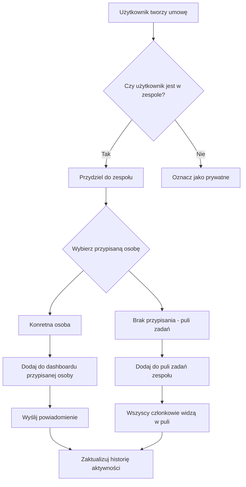
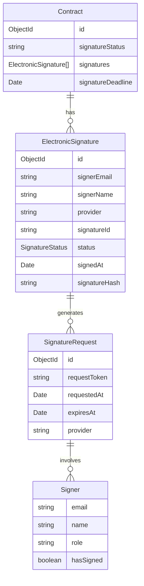
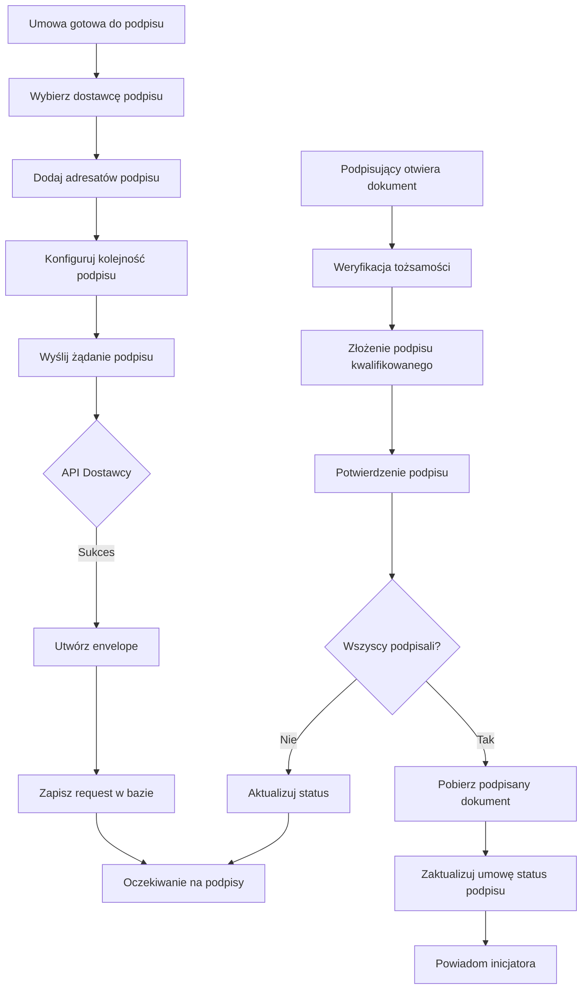

# Plan Rozwoju Aplikacji Zarządzania Umowami

## 1. Analiza Obecnego Stanu

### 1.1 Stack Technologiczny

- **Frontend:** Next.js 15+ (App Router) + Tailwind CSS + shadcn/ui
- **Backend:** Node.js + TypeScript
- **Baza danych:** MongoDB
- **Autoryzacja:** NextAuth.js
- **AI/OCR:** OpenAI API (GPT-4o, GPT-4 Turbo)

### 1.2 Obecne Funkcjonalności

- ✅ System autoryzacji z rolami (Admin, Edycja, Odczyt)
- ✅ Dashboard z przeglądem systemu
- ✅ CRUD dla umów
- ✅ Upload plików PDF z drag & drop
- ✅ Zarządzanie słownikami
- ✅ System notatek dla każdej umowy
- ✅ Wyszukiwarka umów
- ✅ OCR - ekstrakcja tekstu z PDF
- ✅ AI - podsumowania umów

### 1.3 Ograniczenia Obecnego Systemu

- **Brak współpracy grupowej:** Użytkownicy pracują niezależnie, brak zespołów
- **Brak podpisów elektronicznych:** Brak integracji z systemami podpisów kwalifikowanych
- **Uproszczony model uprawnień:** Tylko 3 poziomy ról, bez granularnej kontroli dostępu
- **Brak powiadomień:** Brak systemu powiadomień o zmianach
- **Brak historii zmian:** Brak audytu działań użytkowników

---

## 2. Współpraca Grupowa (Team Collaboration)

### 2.1 Architektura Współpracy Grupowej

```mermaid
erDiagram
    User ||--o{ TeamMember : belongs_to
    Team ||--o{ TeamMember : has
    Team ||--o{ Contract : manages
    Contract ||--o{ ContractActivity : has
    User ||--o{ ContractActivity : performs
    
    User {
        string id
        string email
        string name
        UserRole role
        boolean isActive
    }
    
    Team {
        string id
        string name
        string description
        ObjectId ownerId
        boolean isActive
        string[] allowedContractTypes
    }
    
    TeamMember {
        ObjectId userId
        ObjectId teamId
        TeamMemberRole role
        Date joinedAt
    }
    
    Contract {
        ObjectId teamId
        string status
        ObjectId assigneeId
    }
    
    TeamMemberRole = "owner" | "admin" | "member" | "viewer"
```

### 2.2 Model Danych - Zespoły

#### Team (Zespół)

```typescript
interface ITeam {
    _id: mongoose.Types.ObjectId;
    name: string;
    description?: string;
    ownerId: mongoose.Types.ObjectId;
    members: ITeamMember[];
    allowedContractTypes: string[];
    isActive: boolean;
    createdAt: Date;
    updatedAt: Date;
}

interface ITeamMember {
    userId: mongoose.Types.ObjectId;
    role: TeamMemberRole;
    joinedAt: Date;
    invitedBy: mongoose.Types.ObjectId;
}

type TeamMemberRole = 'owner' | 'admin' | 'member' | 'viewer';
```

#### ContractActivity (Aktywność/Audit Log)

```typescript
interface IContractActivity {
    _id: mongoose.Types.ObjectId;
    contractId: mongoose.Types.ObjectId;
    teamId?: mongoose.Types.ObjectId;
    userId: mongoose.Types.ObjectId;
    action: ContractAction;
    details?: Record<string, unknown>;
    createdAt: Date;
}

type ContractAction = 
    | 'created' | 'updated' | 'viewed' | 'downloaded'
    | 'signed' | 'note_added' | 'status_changed'
    | 'assigned' | 'ocr_completed' | 'comment_added';
```

### 2.3 Funkcjonalności Współpracy Grupowej

#### 2.3.1 Zarządzanie Zespołami

- [ ] Tworzenie zespołów z nazwą i opisem
- [ ] Zapraszanie członków przez email
- [ ] Role w zespole: Owner, Admin, Member, Viewer
- [ ] Zarządzanie członkami (dodawanie, usuwanie, zmiana ról)
- [ ] Konfiguracja typów umów dostępnych dla zespołu

#### 2.3.2 Przydzielanie i Śledzenie

- [ ] Przydzielanie umów do konkretnych członków zespołu
- [ ] Widok "Moje przydzielone umowy"
- [ ] Dashboard zespołu z podsumowaniem aktywności
- [ ] Priorytety umów (wysoki, średni, niski)
- [ ] Termin realizacji dla zadań

#### 2.3.3 Komentarze i Dyskusje

- [ ] Komentarze wątkowe przy umowach
- [ ] @wzmianki członków zespołu
- [ ] Powiadomienia o nowych komentarzach
- [ ] Edycja i usuwanie własnych komentarzy

#### 2.3.4 Historia i Audyt

- [ ] Automatyczne logowanie wszystkich akcji
- [ ] Oś czasu aktywności dla każdej umowy
- [ ] Porównywanie wersji metadanych
- [ ] Eksport historii do CSV/PDF

#### 2.3.5 System Powiadomień

- [ ] Powiadomienia email o zmianach statusu
- [ ] Powiadomienia o nowych komentarzach
- [ ] Przypomnienia o nadchodzących terminach
- [ ] Panel powiadomień w aplikacji
- [ ] Konfiguracja preferencji powiadomień

### 2.4 Diagram Przepływu Pracy Zespołowej



---

## 3. Podpisy Kwalifikowane (Qualified Electronic Signatures)

### 3.1 Architektura Podpisów Kwalifikowanych



### 3.2 Integracja z Dostawcami Podpisów

#### Obsługiwani Dostawcy (Polska)

1. **BiznesPlatform** - popularny w Polsce, API REST
2. **Sigillum** - rozwiązanie Asseco
3. **Autenti** - platforma e-obiegów dokumentów
4. **Adobe Acrobat Sign** - globalne rozwiązanie
5. **DocuSign** - globalne rozwiązanie

#### Abstrakcyjny Interfejs Dostawcy

```typescript
interface ISignatureProvider {
    name: string;
    
    // Autoryzacja
    authenticate(): Promise<void>;
    
    // Tworzenie dokumentu do podpisu
    createEnvelope(
        document: Buffer,
        documentName: string,
        signers: SignerInfo[]
    ): Promise<string>;
    
    // Status podpisu
    getEnvelopeStatus(envelopeId: string): Promise<SignatureStatus>;
    
    // Pobieranie podpisanego dokumentu
    downloadSignedDocument(envelopeId: string): Promise<Buffer>;
    
    // Anulowanie żądania podpisu
    cancelEnvelope(envelopeId: string): Promise<void>;
    
    // Weryfikacja podpisu
    verifySignature(signedDocument: Buffer): Promise<SignatureVerification>;
}

interface SignerInfo {
    email: string;
    name: string;
    order: number;
    role?: string;
}

interface SignatureStatus {
    envelopeId: string;
    status: 'pending' | 'sent' | 'delivered' | 'signed' | 'declined' | 'expired';
    signers: SignerStatus[];
    completedAt?: Date;
}
```

### 3.3 Funkcjonalności Podpisów Kwalifikowanych

#### 3.3.1 Zarządzanie Podpisami

- [ ] Konfiguracja dostawców podpisów (settings)
- [ ] Dodawanie wielu podpisujących z kolejnością
- [ ] Śledzenie statusu podpisu w czasie rzeczywistym
- [ ] Automatyczne przypomnienia dla niepodpisanych
- [ ] Przedłużanie terminów podpisu

#### 3.3.2 Proces Podpisywania

- [ ] Inicjowanie żądania podpisu z UI
- [ ] Wielopodpisowy workflow (sekwencyjny/parallelowy)
- [ ] Przekierowanie do zewnętrznego dostawcy
- [ ] Webhook do odbierania statusu podpisu
- [ ] Automatyczne pobieranie podpisanego dokumentu

#### 3.3.3 Weryfikacja i Walidacja

- [ ] Weryfikacja integralności dokumentu po podpisie
- [ ] Sprawdzanie certyfikatów kwalifikowanych
- [ ] Walidacja znacznika czasu (timestamp)
- [ ] Export raportu weryfikacji

#### 3.3.4 Przechowywanie i Archiwizacja

- [ ] Przechowywanie oryginalnego i podpisanego dokumentu
- [ ] Metadane podpisu w bazie danych
- [ ] Link do pobrania podpisanego PDF
- [ ] Archiwizacja zgodna z wymogami prawnymi

### 3.4 Diagram Przepływu Podpisywania



---

## 4. Harmonogram Implementacji

### Faza 1: Współpraca Grupowa - Podstawy

1. Model danych Team i TeamMember
2. API CRUD dla zespołów
3. Zarządzanie członkostwem
4. Przydzielanie umów do zespołów

### Faza 2: Współpraca Grupowa - Zaawansowane

1. System komentarzy z wątkami
2. Historia aktywności (audit log)
3. Dashboard zespołowy
4. System powiadomień

### Faza 3: Podpisy Kwalifikowane - Podstawy

1. Model danych dla podpisów
2. Interfejs abstrakcyjny ISignatureProvider
3. Implementacja pierwszego dostawcy (np. BiznesPlatform)
4. API do inicjowania podpisów

### Faza 4: Podpisy Kwalifikowane - Zaawansowane

1. Webhook do odbierania statusu
2. Weryfikacja podpisów
3. Pobieranie podpisanego dokumentu
4. UI do zarządzania podpisami

### Faza 5: Integracja i Optymalizacja

1. Powiadomienia email o statusie podpisów
2. Raportowanie i eksport
3. Testy integracyjne
4. Dokumentacja użytkownika

---

## 5. Wymagane Zmiany w Kodzie

### 5.1 Nowe Modele

- `src/models/Team.ts` - Model zespołu
- `src/models/TeamMember.ts` - Członkostwo w zespole
- `src/models/ContractActivity.ts` - Historia aktywności
- `src/models/SignatureRequest.ts` - Żądanie podpisu
- `src/models/ElectronicSignature.ts` - Podpis elektroniczny

### 5.2 Nowe API Routes

- `src/app/api/teams/` - CRUD zespołów
- `src/app/api/teams/[id]/members/` - Zarządzanie członkami
- `src/app/api/contracts/[id]/assign/` - Przydzielanie umów
- `src/app/api/contracts/[id]/signatures/` - Zarządzanie podpisami
- `src/app/api/signatures/webhook/` - Webhook od dostawcy
- `src/app/api/signatures/providers/` - Konfiguracja dostawców

### 5.3 Rozszerzenia Istniejących Modeli

- **Contract.ts** - dodanie: teamId, assigneeId, signatureDeadline, signatureStatus
- **User.ts** - dodanie: defaultTeamId, notificationPreferences

### 5.4 Nowe Komponenty UI

- `src/components/teams/` - Komponenty zespołów
- `src/components/signatures/` - Komponenty podpisów
- `src/components/activity/` - Historia aktywności
- `src/components/notifications/` - Panel powiadomień

### 5.5 Nowe Strony

- `/teams` - Lista zespołów
- `/teams/[id]` - Szczegóły zespołu
- `/teams/create` - Tworzenie zespołu
- `/contracts/[id]/sign` - Proces podpisywania
- `/contracts/[id]/activity` - Historia aktywności

---

## 6. Wymagania Techniczne

### 6.1 Zależności

```json
{
  "dependencies": {
    "nodemailer": "^6.9.0",
    "uuid": "^9.0.0",
    "date-fns": "^3.0.0"
  }
}
```

### 6.2 Zmienne Środowiskowe

```env
# Podpisy kwalifikowane
BIZNESPLATFORM_API_KEY=your-key
BIZNESPLATFORM_API_URL=https://api.biznesplatform.pl

# Powiadomienia
SMTP_HOST=smtp.example.com
SMTP_PORT=587
SMTP_USER=your-email
SMTP_PASSWORD=your-password
FROM_EMAIL=noreply@your-domain.com
```

---

## 7. Ryzyka i Mitigacje

| Ryzyko | Mitigation |
|--------|------------|
| Opóźnienia w integracji API dostawców | Implementacja mock providera do testów |
| Złożoność zarządzania stanami podpisów | FSM dla statusów |
| Bezpieczeństwo podpisów kwalifikowanych | Audyt bezpieczeństwa, compliance check |
| Wydajność przy wielu zespołach | Indeksowanie bazy danych, caching |
| Kompatybilność wsteczna | Feature flags, gradual rollout |

---

## 8. Priorytety

### Wysoki Priorytet

- Podstawowy model zespołów
- Przydzielanie umów
- Integracja z jednym dostawcą podpisów
- Podstawowy webhook

### Średni Priorytet

- System komentarzy
- Historia aktywności
- Dashboard zespołowy
- Weryfikacja podpisów

### Niższy Priorytet

- Zaawansowane powiadomienia
- Wielu dostawców podpisów
- Raportowanie
- Feature flags dla nowych funkcji
